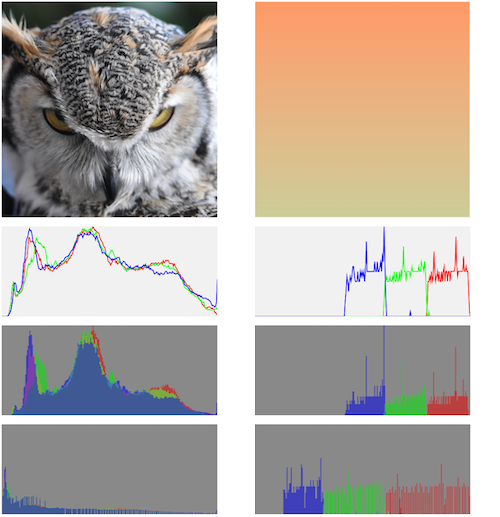

# What is wrong with my CIAreaHistogram?

I would like to use the histogram `CIAreaHistogram` and `CIHistogramFilter` from Core Image Filter in my app. The implementation is relatively simple. Starting from a `UIImage` you have to create a `CIImage` and pass it to the filter queue.
Some parts of the source code are shown below.

## The Problem

When I compare the calculated and displayed histograms with histograms from 'Photoshop' or 'Photos', I found out that they do not match. The wrong histogram is the lower histogram in the picture.
To determine the cause of the problem, I first developed a subroutine `calculateHistogram` without using these filters. The result of the calculation is displayed in the `HistogramView` (`UIView`). The calculation is correct and corresponds to the expectations (upper histogram in the picture).

In the next step, I wanted to find out which of the two filters caused the problem. For this I converted the pixel data of my calculation into a `CIImage` (width = 256, height = 1) and transferred this `CIImage` as input to the `CIHistogramFilter`. As can be seen in the middle histogram of the image, this histogram is also correct.

Based on these considerations, I suspect that something is wrong with the calculation in `CIAreaHistogram`. On the other hand, it is also possible that I have made a mistake in using the filters.
Does anyone have an explanation for this problem?

 

## Example

Example of calculating and displaying a histogram using the Core Image Filters.
``` swift
	let sourceImage = UIImage(named: name )
	let sourceCGImage = sourceImage!.cgImage!
	let sourceCIImage = CIImage(cgImage: sourceCGImage)
	
	let imageHist1 = areaHistogramFilter(sourceCIImage, rect: sourceCIImage.extent)
	
	let histImage1 = histogramDisplayFilter(imageHist1!, height: 200, highLimit: 1.0, lowLimit: 0.0)
	let cgImage1 = context.createCGImage(histImage1!, from: histImage1!.extent)
	let uiImage1 = UIImage(cgImage: cgImage1!)
	
	// Show the histogram in UIImageView
	
	histogramView1.image = uiImage1

```

## Subroutines for the Core Image Filters
``` swift

func areaHistogramFilter(_ input: CIImage, rect: CGRect, count: Int = 256, scale: Float = 15) -> CIImage?
{
	let filter = CIFilter(name:"CIAreaHistogram")
	filter?.setValue(input, forKey: kCIInputImageKey)
	filter?.setValue(CIVector(cgRect: rect), forKey: "inputExtent")
	filter?.setValue(count, forKey: "inputCount")
	filter?.setValue(scale, forKey: "inputScale")
	return filter?.outputImage
}

func histogramDisplayFilter(_ input: CIImage, height: Float = 100, highLimit: Float = 1.0, lowLimit: Float = 0.0) -> CIImage?
{
	let filter = CIFilter(name:"CIHistogramDisplayFilter")
	filter?.setValue(input,     forKey: kCIInputImageKey)
	filter?.setValue(height,    forKey: "inputHeight")
	filter?.setValue(highLimit, forKey: "inputHighLimit")
	filter?.setValue(lowLimit,  forKey: "inputLowLimit")
	return filter?.outputImage
}

```

